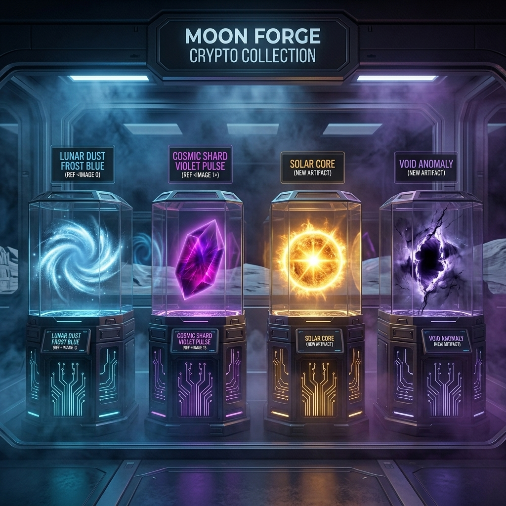

# Moon Forge Protocol


> **"Don't wait for the party. Forge it."**

Moon Forge is a decentralized, community-owned burn-to-earn protocol. Burn XEN on any supported EVM chain. Earn XNT on the X1 Blockchain. No team. No VC. No admin keys. The code runs itself.

🚀 **[LIVE SITE / DEMO](https://xen-moon-forge-protocol.github.io/Moon-Forge/)**

> **"Don't wait for the party that never arrives. Forge your own sovereignty today."**

---

## Current Deployment Status

| Component | Status | Address |
|-----------|--------|---------|
| **Anchor Program (X1 mainnet)** | ✅ Live | `57UE1U1t23ztg2noLp8pcpGW1B1Xw25rLH6ra9Mchea9` |
| **Reward Vault PDA** | ✅ Live | `CScsBfpj63Mppem9Bmddmfi87bkcAfeLevdSauYMDsHR` |
| **Protocol State PDA** | ✅ Live | `5dLsHmw6VvsbPhuHte6E2QJjm87oAWC1VxN43ngYfSGn` |
| **Dev Escrow PDA** | ✅ Live | `8hAFXd1PhioLnR9VhsuCSC6m2Yi3yigpfLccuMFk6G7x` |
| **EVM Portals** | ⏳ Community deploy needed | See [DEPLOY.md](DEPLOY.md) |
| **Oracle** | ⏳ Community run needed | See [OPERATORS.md](OPERATORS.md) |
| **NFT Artifacts** | 📋 Phase 2 — code ready | See roadmap |

> The X1 program is deployed and initialized. All fees are hardcoded on-chain.
> The dev wallet (`7PuG8ELKXzvZqVLawFnmjDJqq4KEyRhssKQEq7aQM6Qd`) receives 2% of all early-exit penalties automatically — forever, immutably.

---

## How It Works

```
[1] User burns XEN on EVM chain  →  MoonForgePortal.sol emits MissionStarted()
[2] Oracle reads event           →  Calculates XNT via CWF × √XEN × Tier
[3] Oracle publishes Merkle root →  Anchor Program on X1 stores the proof
[4] User claims on X1            →  XNT vests linearly from reward_vault PDA
```

**Forge Score Formula:**
```
Score = √(XEN_burned × CWF) × Tier_Multiplier × NFT_Boost
```
- **CWF:** Normalizes economic effort across chains (gas cost + AMP inflation + price)
- **Square root:** Compresses whale advantage — fair for everyone
- **Tiers:** 5d/1× | 45d/2× | 180d/3× commitment levels

---

## What Needs to Run (Community)

The X1 program is already live. To make the full protocol functional, the community needs to:

### 1. Deploy at least one EVM Portal (~$5 on Optimism)
```bash
# Install dependencies
npm install

# Set PRIVATE_KEY in .env
cp .env.example .env
# edit .env

# Deploy on Optimism (cheapest — recommended first)
npx hardhat run scripts/deploy_portal.ts --network optimism
```
See [DEPLOY.md](DEPLOY.md) for all chains.

### 2. Run the Oracle (free — needs a server or local machine)
```bash
cd oracle
npm install
cp .env.example .env
# Fill in: X1_PROGRAM_ID, ORACLE_PRIVATE_KEY, portal addresses, RPCs
npm start
```
See [OPERATORS.md](OPERATORS.md) for full setup.

### 3. Host the Frontend (free — GitHub Pages, Vercel, Netlify)
```bash
cd frontend
npm install
npm run build
# Deploy /dist to any static host
```
See [OPERATORS.md](OPERATORS.md) for GitHub Pages setup.

---

## Repository Structure

```
/contracts     Solidity: EVM burn portals + (Solidity stubs for X1 reference)
/oracle        TypeScript: Off-chain bridge — reads EVM events, publishes Merkle roots to X1
/frontend      React 18 + Vite + Tailwind — full UI, ready to deploy
/programs      Rust/Anchor: X1 SVM program (DEPLOYED — see address above)
/scripts       Hardhat deploy scripts for EVM portals
/docs          Whitepaper (economic model v12.0)
```

---

## Tiers

| Tier | Duration | Multiplier | Early Exit Penalty |
|------|----------|------------|--------------------|
| Launchpad | 5 days | 1.0× | 0% |
| Orbit | 45 days | 2.0× | 20% |
| Moon Landing | 180 days | 3.0× | 50% |

Early exit penalties are split: **93.5% stays in the reward pool** (benefits all pilots), 1% oracle, 2% referrer, 2% dev wallet, 1.5% dev escrow.

---

## NFT Artifacts (Phase 2)



Solidity contracts (`contracts/MoonArtifacts.sol`) are complete and ready to deploy.
X1 Anchor program for NFTs is Phase 2 — code pending, community can contribute.

| Tier | Supply | Boost | Floor Price |
|------|--------|-------|-------------|
| Lunar Dust | 600 | +5% | 5 XNT |
| Cosmic Shard | 300 | +10% | 10 XNT |
| Solar Core | 90 | +20% | 20 XNT |
| Void Anomaly | 10 | +50% | 50 XNT |

---

## Fee Structure (Hardcoded On-Chain — Immutable)

| Recipient | Share | Notes |
|-----------|-------|-------|
| Reward Pool | 93.5% | Redistributed to all pilots |
| Oracle | 1.0% | Gas compensation for whoever runs it |
| Referrer | 2.0% | 0 if no referrer — stays in pool |
| Dev Wallet | 2.0% | `7PuG8ELKXzvZqVLawFnmjDJqq4KEyRhssKQEq7aQM6Qd` |
| Dev Escrow | 1.5% | Returns to pool if protocol grows |

**Only applies to early-exit penalties. Normal deposits have zero fee.**

---

## Chain Rollout Schedule

| Chain | Day | Deploy Instructions |
|-------|-----|---------------------|
| Optimism | Day 0 | [DEPLOY.md](DEPLOY.md) — ~$5 |
| Ethereum | Day 0 | [DEPLOY.md](DEPLOY.md) — ~$200-500 |
| BSC | Day 13 | [DEPLOY.md](DEPLOY.md) — ~$2 |
| Polygon | Day 26 | [DEPLOY.md](DEPLOY.md) — ~$1 |
| Avalanche | Day 26 | [DEPLOY.md](DEPLOY.md) — ~$3 |
| Base | Day 39 | [DEPLOY.md](DEPLOY.md) — ~$3 |
| PulseChain | Day 39 | [DEPLOY.md](DEPLOY.md) — ~$1 |

Anyone can deploy on any chain, in any order. The oracle picks up new portals automatically once added to its config.

---

## Roadmap

### Done ✅
- [x] Anchor program — deployed on X1 mainnet, protocol initialized
- [x] Reward vault, bankroll vault, dev escrow PDAs — live on-chain
- [x] Solidity EVM portals — compiled, ready to deploy
- [x] Oracle — TypeScript, full CWF formula, Merkle proof generation
- [x] Frontend — React 18, all pages, dual wallet (MetaMask + X1 Wallet)
- [x] Economic model v12.0 (CWF Fair Value Engine)
- [x] Whitepaper v12.0

### Community — Phase 1 (Now Open)
- [ ] Deploy EVM portals (start with Optimism — cheapest)
- [ ] Run the oracle (free Node.js service)
- [ ] Host the frontend (GitHub Pages is free)
- [ ] Verify first burn → claim cycle end-to-end

### Community — Phase 2 (NFTs)
- [ ] Write X1 Anchor program for MoonArtifacts NFTs (~5 XNT deploy cost)
- [ ] Deploy MoonArtifacts.sol on EVM chains
- [ ] 1,000 NFT metadata files (specs in `/data`) — IPFS upload
- [ ] Enable oracle NFT boost reading

### Community — Phase 3 (Analytics & Games)
- [ ] On-chain games (MoonGames, MoonLottery, MoonPredictions — Solidity ready)
- [ ] Analytics dashboard (TVL, burns by chain, epoch history)
- [ ] Alternative frontends
- [ ] Mobile-friendly UI improvements

---

## Documentation

| Document | Description |
|----------|-------------|
| [WHITEPAPER](docs/WHITEPAPER.md) | Economic model, CWF formula, tier mechanics |
| [ARCHITECT](ARCHITECT.md) | Sustainability model & how the project is funded |
| [DEPLOY](DEPLOY.md) | Step-by-step: EVM portal deployment for any chain |
| [OPERATORS](OPERATORS.md) | How to run the oracle and host the frontend |
| [IMMUTABILITY](IMMUTABILITY.md) | What is locked forever vs what the community can change |
| [CONTRIBUTING](CONTRIBUTING.md) | How to contribute |
| [SECURITY](SECURITY.md) | Vulnerability reporting |
| [BRANDING](branding/README.md) | Official visual assets & Launch Kit |
| [FORK](FORK.md) | How to re-deploy and launch your own version |

---

## Immutability Guarantee

The Anchor program is deployed with no upgrade path configured for community governance.
Fee splits, tier mechanics, and wallet addresses are **permanently hardcoded on-chain**.
No one can change them — including whoever wrote this code.

---

## License

MIT — Take control. Build your own. The forge is open.

---


*Anonymous, open-source, community-driven. Don't wait for the party. Forge it.*
